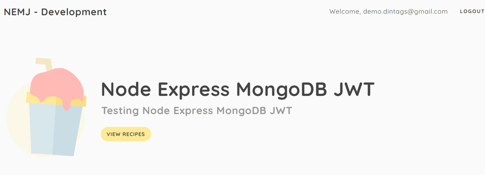

# Node Express MongoDB JWT 🎁🎁✨✨

This is a Node Js based Authentication System With JWT.

## Features 🥇🥇🥇

- User Need to login to the website to visit the product page.
- User Session validation based on JWT Token Cookie. 

## Images

